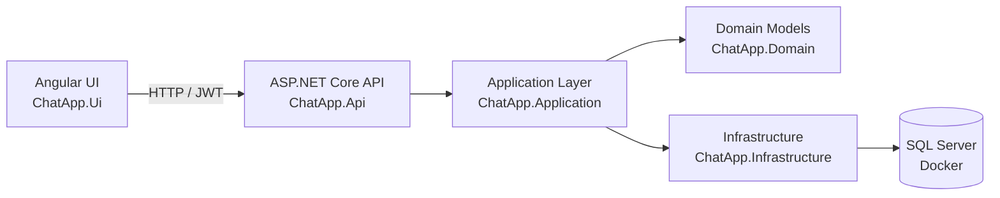

# ChatApp – Real-Time Chat Platform

A full-stack real-time chat application built with **ASP.NET Core (.NET 8), Angular, SQL Server, and SignalR**.

This project demonstrates a **clean layered architecture**, modern **authentication practices**, and **real-time communication patterns** used in enterprise applications.

---

# Architecture Overview

The application follows a **layered architecture** separating API, application logic, domain models, infrastructure, and UI.



---

# Solution Structure

```
src/
 ├ ChatApp.Api
 ├ ChatApp.Application
 ├ ChatApp.Domain
 ├ ChatApp.Infrastructure
 ├ ChatApp.Tests
 └ ChatApp.Ui
```

---

# Tech Stack

## Backend
- .NET 8
- ASP.NET Core Web API
- ASP.NET Identity
- JWT Authentication
- Entity Framework Core

## Frontend
- Angular
- TypeScript
- RxJS

## Infrastructure
- SQL Server
- Docker
- Swagger / OpenAPI
- EF Core migrations

---

# Running the Project

## 1. Clone

```
git clone https://github.com/<your-username>/chatapp-dotnet-angular.git
cd chatapp-dotnet-angular
```

## 2. Start SQL Server

```
docker run -e "ACCEPT_EULA=Y" -e "MSSQL_SA_PASSWORD=<YourPassword>" -p 1433:1433 --name chatapp-sql -d mcr.microsoft.com/mssql/server:2022-latest
```

## 3. Configure connection

```
dotnet user-secrets set "ConnectionStrings:ChatAppDatabase" "Server=localhost,1433;Database=ChatAppDb;User Id=sa;Password=<password>;TrustServerCertificate=True;MultipleActiveResultSets=true" --project src/ChatApp.Api/ChatApp.Api.csproj
```

## 4. Apply migrations

```
dotnet ef database update --project src/ChatApp.Infrastructure --startup-project src/ChatApp.Api
```

## 5. Run API

```
dotnet run --project src/ChatApp.Api
```

Swagger:

https://localhost:7072/swagger

## 6. Run Angular

```
cd src/ChatApp.Ui
npm install
npm start
```

UI:

http://localhost:4200

---

# Author

Abhi Basu
